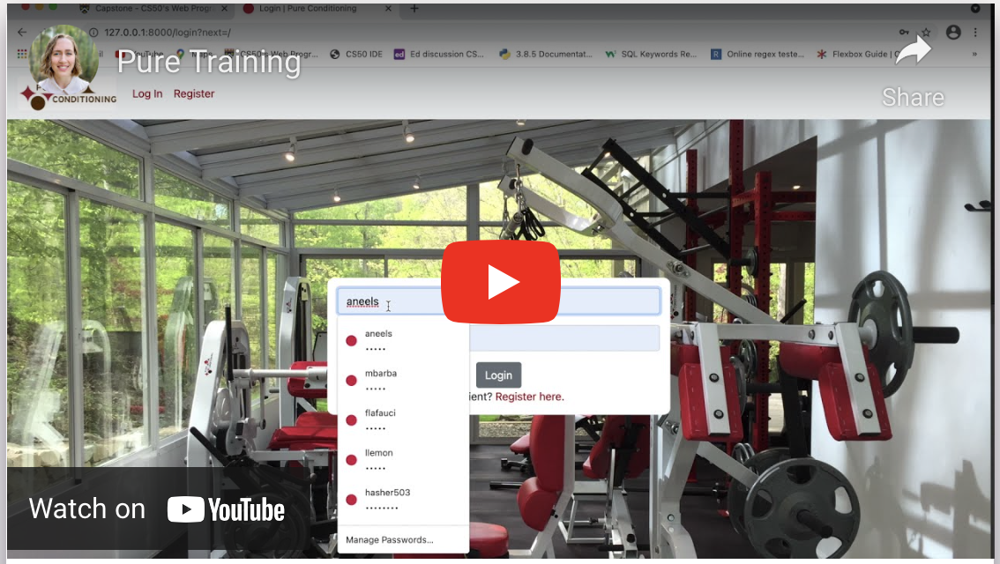

# Pure Training: a workout tracking application for personal trainers and their clients
Completed April 2021 (solo project)

## Tech Stack:
* Python
* Django
* SQLite
* JavaScript
* REST APIs
* HTML
* CSS
* Bootstrap

## Video Demo

## Intro
This project is a web application for personal trainers and other fitness professionals to log and track progress of strength training workouts. The application is designed so that multiple trainers, working together, can document their clients' workouts and share client charts for virtual/Zoom sessions. Though the site could easily be used for in-person workouts, its main benefit is for clients who train virtually. Additionally, the app is designed so that clients can log in to their personal portal and view their past workout sessions, routines, and strength progress on specific exercises, motivating them to continue work with their personal trainer as they see positive results.

To view pages in this website, a user must be logged in, because the functionality of the application depends on whether the user is a trainer or a client. A user is a trainer if they are denoted as "staff", which can be changed through the Django admin interface. Besides user access level, all the other models for this site can be manipulated by trainers through the actual website, without needing to access the admin interface. 

## How to Run
1. Clone this repository, navigate to the project and type the following commands:
2. Activate a virtual environment: 'python3 -m venv .venv' and select the virtual environment as the active workspace
3. Install dependencies: 'pip install -r requirements.txt'
4. Run the project: 'python3 manage.py runserver'
5. log in as a trainer to log sessions and routines:
* username: 'testuser'
* password: 'test'

## Django Database Models
For purposes of understanding this application, the following model definitions will be useful. All of these models are defined in "models.py". An "Exercise" is a single given exercise such as squat, deadlift, bicep curl, etc. It is not an instance of an exercise performed during a workout, but rather an abstract definition on which to base a routine. An Exercise has a body part (choices limited to back, chest, arms, shoulders, legs, core, and other) and a name. A "Routine" is a pre-set pattern of exercises, like a blueprint on which to base a workout. For example, a typical routine might be "squat, dumbbell row, chest press, plank, arnold press". A Routine also has a name to differentiate it from the others, a client to whom the routine belongs, a start date (whenever it was created), and an "archived" boolean--describing whether the Routine is actively being used in the workout cycle and should be included as an option to base a workout Session upon. A "Session" is an instance of a workout, performed by a client and logged by a trainer. It is based on a routine (e.g. all sets performed will be derived from the Routine blueprint), a timestamp (exact datetime at which the workout session occurred), and a trainer (must be specified because the app can have multiple trainers). A "Setgroup" is a group of sets of one specific exercise, belonging to a workout Session. This is a way to group the Sets of an exercise. A Setgroup has an Exercise, a Session which it's a part of, a Note (for example if a superset, drop set, or blood flow occlusion technique was used) and an order (which order in the workout Session it occurred). Finally, a Set is one instance of an exercise performed-- for example, 12 reps of squat with 135 lb. Each Set has a weight, time or number of reps, and order within Setgroup(set 1, set 2, set 3). The weight and time fields are intentionally stored as strings, not ints, because sometimes a trainer might want to record time (1 min 30 seconds of plank) vs sometimes they might record reps. Sometimes they might want to record bands or bodyweight (e.g. red band for band pull-aparts) vs traditional barbell weights. Every Set belongs to a Setgroup, which belongs to a workout Session, which belongs to a Routine, which belongs to a Client. The Set and Session models also have Serialize methods defined for API requests.

## Views
### Trainer Views
The following pages are visible for users who are logged in as trainers (accessible through the navbar at top):

- Index (Home) page: this is the default view when a trainer logs in. This page shows all workout Sessions for all clients, in reverse chronological order. This page (along with any page displaying workout Sessions) has pagination showing 10 Sessions at a time. It is rendered by the following files: "index.html", "charttemplate.html", "pagetemplate.html"

- New Session page: a trainer clicks here to start a new workout Session. On the first page, the trainer selects which Routine the session will be based on (a dropdown Select showing all active routines) and which trainer is logging the session. Upon clicking "create", the trainer is taken to a page displaying a blank form for logging Setgroups(order number and note) and Sets (weight and time) for the workout. This page is not a Django form but a series of input boxes with JavaScript Event Listeners. When buttons are clicked, the workout data is sent to an API route without reloading the page. Trainers can also add a new Exercise to the routine through this page or delete the session. When the trainer clicks Complete, the view checks to see if Sets have been logged. If Setgroups are empty (contain no sets) an alert popps up - "X empty setgroup(s) will be deleted. This will not alter the routine." When the user confirms, the empty setgroups are deleted and the page is redirected to the Index. If a trainer tries to access the newsession route for a workout that already has sets logged, they are redirected to the Edit page. These pages are rendered by the following files: "newsession1.html", "newsession2.html", "static/train/newsession2.js", "static/train/helpers.js". (the "helpers.js" file contains methods used in both the New Session and Edit Sesssion views, contained in one Module and exported to reduce redundant code.)

- Edit Session page: here a trainer can edit any previously logged workout Sessions. When clicked, the first page allows the trainer to select which client's routine they'd like to edit. Once selected, a new select box is rendered with JavaScript showing the past workout Sessions for that client. Clicking "submit" takes the trainer to a workout form with the fields pre-populated with that Session's Setgroup and Set data. In addition to updating the values, the trainer can also add new Sets and new Exercises to the Session. The "Delete" and "Done" buttons have the same functionality as those on the New Session page. These pages are rendered with the following files: "editsession1.html", "editsession2.html", "static/train/editsession1.js", "static/train/editsession2.js", "static/train/helpers.js".

- Exercises page: here a trainer can add new Exercises to be used in Routines, and delete Exercises which have not been used in Routines. (Exercises that have already been used in Routines cannot be deleted because that would adversely affect past workout Sessions.) Adding and deleting exercises are aided with JavaScript functionality. This page is rendered with the following files: "exercises.html", "static/train/exercises.js".

- Routines: clicking this on the navbar displays two options: New Routine and Edit/Archive Routine. Clicking "New Routine" takes the trainer to a page to create a new Routine for a client. Here the trainer enters the Routine name, which client it belongs to, and which exercises will belong to the Routine. All exercises are grouped by body part category to make creating a new Routine easy and intuitive. Clicking "Create" adds the new Routine to the database if all inputs are valid, then redirects to the "Edit/Archive Routine" page. The "Edit/Archive Routine" page displays all the Routines for all clients in reverse chronological order, and whether they are archived. On this page the trainer can select checkboxes to archive/unarchive any routine without reloading the page. Clicking on a routine from this list takes the trainer to a new page to update the Routine information. This page is identical to the New Routine page, except that all data from the existing routine is pre-populated into the form fields. These Routine pages are rendered by the following files: "editroutine.html", "newroutine.html", "routinelist.html", "static/train/routinelist.js".

- Charts: this view shows all past workout sessions for a client (their "chart"). Clicking this page initially shows all workout sessions for all clients, similar to the index page. Upon selecting a client from the select dropdown, the page loads all workout sessions for just that client, in reverse chronological order. Like the index page, this page has pagination, with the added feature that clicking the "next" or "previous" page retains the specific client's chart the trainer is trying to view. This page is rendered with the following files: "charts.html", "charttemplate.html", "paginate-charts.html", "static/train/charts.js".

### Client Views
The following pages are visible for users who are logged in as clients:

- Home/Index page: like the trainer home page, this shows all sessions in reverse chronological order, except here it only shows Sessions belonging to the client who is logged in. It's rendered by the same files as the trainer index page.

- My Routines: similar to the trainer Charts page, this allows the client to select a specific Routine and view all their past workout Sessions belonging to that routine. Doing so, a client can see how often that Routine has been performed as well as their progress. This page also has pagination, showing 10 routines at a time, and is rendered by the following files: "clientroutines.html", "charttemplate.html", "paginate-client.html", "static/train/charts.js".

- Strength Progress: this page allows a client to see their progress over time on any given Exercise. Clicking this displays a list of all Exercises, limited to those the client has ever actually performed Setgroups of. Upon clicking any exercise in the list, the div expands to show the history (reverse chronological order) of all Sets of that exercise the client has ever done. Upon clicking another exercise, that table is hidden and the information for the new exercise is displayed. All of this information is fetched with javascript, without ever reloading the page. This page is rendered by the following files: "clientprogress.html", "static/train/clientprogress.js"

### Unauthenticated Views
The only pages that are visible to users who are not logged in are the login page (rendered by "login.html"), logout page ("logout.html"), and register page ("register.html"). All of these pages have images advertising the company gym. Additionally, the Error page (rendered by "error.html") is displayed anytime a request malfunctions--for example if a trainer somehow tries to access or edit a Workout Session that does not exist.

## Responsive Design
The site is mobile-responsive, designed using Bootstrap. Many aspects of the page, including the top nav-bar and columns, automatically resize or change their layout depending on the size of the viewport. Professional-looking styling has been added using Bootstrap and CSS ("static/train/styles.css")

## Summary
This was my most complex project as of April 2021, containing multiple interrelated database models, 20 HTML templates, eight JavaScript files to minimize page reloads, and 26 functions in the "views.py" file including 11 API endpoints for asynchronous JavaScript requests. Moreover, this application was designed to be practically useful for a real small business, with great attention to features that would make the site practical and functional for real users.
